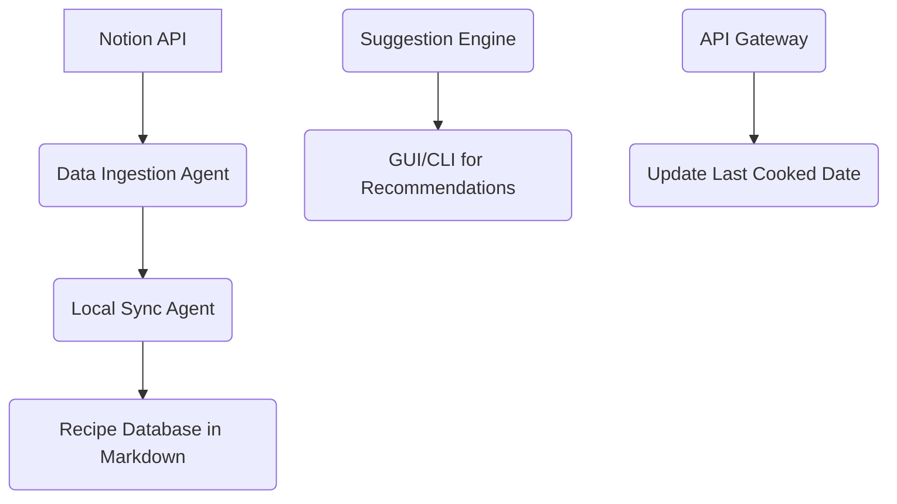

# Technical Specification Document: Notion Cooking Book Integration

## 1. Executive Summary
The goal of this project is to create an integration that enhances a personal cooking routine by leveraging data from a Notion-based cooking book. The solution will enable periodic synchronization of recipe metadata and ingredients, track the last time recipes were cooked, and provide personalized recommendations based on ingredient preferences. This system aims to streamline recipe management, improve accessibility, and enhance decision-making for meal planning.

## 2. Problem Statement
The current process of managing and accessing cooking recipes is fragmented and lacks personalization. Recipes are stored in a Notion database, but there is no efficient way to sync this data locally or generate tailored recommendations based on usage history and ingredient availability. This integration addresses these gaps by providing:

- **Efficient Data Sync:** Periodic downloads of recipe metadata and ingredients.
- **Usage Tracking:** Ability to track when recipes are last cooked.
- **Personalized Recommendations:** A system to suggest recipes based on historical usage and ingredient preferences.

## 3. Proposed Architecture

### System Overview
The architecture is designed as a modular, event-driven system composed of four main components:

1. **Data Ingestion Agent**
2. **Local Sync Agent**
3. **Recipe Suggestion Engine**
4. **API Gateway**

### Component Breakdown

#### Data Ingestion Agent
- **Responsibility:** Polls the Notion API at scheduled intervals to retrieve recipe metadata, ingredients, and updates.
- **Technology:** Python script using the Notion API (v2022-06-22).
- **Modularity:** Decoupled from other components for independent scalability.

#### Local Sync Agent
- **Responsibility:** Converts ingested data into structured formats (JSON/YAML) and stores it in Markdown files with YAML frontmatter.
- **Technology:** Python script leveraging `PyYAML` and `pathlib`.
- **Modularity:** Ensures local data control and offline accessibility.

#### Recipe Suggestion Engine
- **Responsibility:** Filters recipes based on last cooked date (older than a month) and ingredient preferences, then selects random suggestions.
- **Technology:** Python script with custom filtering logic.
- **Modularity:** Encapsulates recommendation logic for future enhancements.

#### API Gateway
- **Responsibility:** Exposes endpoints for updating "last cooked" dates and retrieving recommendations.
- **Technology:** Flask/FastAPI framework.
- **Modularity:** Facilitates integration with other systems or user interfaces.

### Data Flow Diagram

## 4. Resolved Constraints

- **Notion API Rate Limits:** Addressed through efficient batching and caching mechanisms.
- **Local Data Storage:** Implemented using Markdown files with YAML frontmatter for structured metadata.
- **Modular Architecture:** Ensured each component operates independently, allowing for scalability and maintainability.

## 5. Technical Stack

| Component               | Technology/Tool          | Reasoning                                      |
|-------------------------|--------------------------|------------------------------------------------|
| Data Ingestion          | Python (requests)        | Versatile and efficient for API interactions. |
| Local Sync             | Python, YAML, pathlib    | Standardized formats for local storage.       |
| Recipe Suggestion Engine | Python                   | Custom logic for filtering and randomization. |
| API Gateway            | Flask/FastAPI            | Exposes RESTful endpoints for updates and queries. |

## 6. Implementation Roadmap

### High-Level Steps
1. **Setup Notion API Credentials**
   - Integrate credentials into secure environment variables.
   - Implement OAuth for authentication.

2. **Develop Data Ingestion Agent**
   - Use the Notion Python SDK to retrieve recipe data.
   - Handle rate limits with batching and caching.

3. **Implement Local Sync Agent**
   - Convert ingested data into structured formats.
   - Store in Markdown files with YAML frontmatter.

4. **Build Recipe Suggestion Engine**
   - Filter recipes based on last cooked date and ingredient preferences.
   - Randomly select a recipe from the filtered list.

5. **Create API Gateway**
   - Expose endpoints for updating "last cooked" dates.
   - Provide recommendations via HTTP requests.

6. **Test and Optimize**
   - Conduct thorough testing of each component.
   - Monitor performance and adjust parameters as needed.

### Expected Timeline
- **Week 1:** Setup Notion credentials and basic API connectivity.
- **Week 2:** Develop data ingestion and local sync logic.
- **Week 3:** Implement recommendation engine and filtering logic.
- **Week 4:** Create API endpoints and test integration.

## 7. Strategic Takeaways

- **Efficiency-First Approach:** By modularizing components, we ensure that each part can be optimized independently without affecting the whole system.
- **Cost Awareness:** The use of Python scripts and local storage minimizes API costs and leverages existing tools for maximum efficiency.
- **Future-Proofing:** The modular architecture allows for easy integration of advanced AI models into the recommendation engine in the future.

## 8. Next Steps

1. **Gather Notion Database Schema:** Obtain details about the current structure of the cooking book database, including property names and relationships.
2. **Standardize Ingredient Parsing:** Develop a mapping system to handle ingredient variations (e.g., "tomato" vs. "tomatoes").
3. **Define Quality Metrics:** Establish how "best recipes" are determined in the Notion database (e.g., ratings, tags).
4. **Determine Preference Input Method:** Decide whether preferences will be entered via a prompt or selected from a list.

By addressing these gaps and following the proposed architecture, this integration will provide a robust solution for managing and enhancing the cooking experience through personalized recommendations and efficient data management.