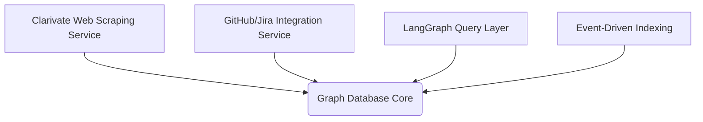

# Technical Specification Document: GraphRag

## 1. Executive Summary
GraphRag is an innovative approach to augment Retrieval Augmented Generation (RAG) with graph-based knowledge representation, enabling more precise and contextually rich responses from Large Language Models (LLMs). By leveraging structured data relationships, GraphRag aims to address the limitations of traditional RAG systems by providing a richer contextual foundation for LLM queries. The core idea is to model domain-specific data as graphs, allowing for more accurate and efficient retrieval of relevant information.

The project will focus on specific domains such as Clarivate products, GitHub repositories, Jira backlogs, and R&D data, starting with a proof-of-concept (POC) using existing tools and data sources. The architecture is designed to be modular, scalable, and cost-aware, ensuring that it can adapt to different domains while maintaining efficiency.

## 2. Problem Statement
While LLMs have demonstrated remarkable capabilities in natural language processing, their effectiveness heavily depends on the quality and relevance of the context provided during retrieval. Traditional RAG systems often rely on vector-based search, which may not capture complex relationships between entities. This leads to several challenges:

- **Context Limitations**: Vector-based retrieval lacks the ability to model complex relationships between entities, leading to less precise answers.
- **Scalability Issues**: Scaling RAG systems requires significant computational resources and careful architecture design.
- **Data Quality Concerns**: Ensuring high-quality data in the graph structure is critical but challenging.
- **Interoperability Challenges**: Integrating with existing tools and workflows requires seamless communication between components.

GraphRag addresses these challenges by introducing a graph-based knowledge representation that enhances context, improves scalability, and ensures interoperability.

## 3. Proposed Architecture
The proposed architecture follows an event-driven, microservices pattern, leveraging LangGraph as the core component for LLM orchestration. The system is designed to be modular, allowing for domain-specific extensions and efficient scaling.

### Key Components:
1. **Clarivate Web Scraping Service**:
   - A headless browser (e.g., Playwright) for extracting and scoring product information.
   - Automated workflows for refreshing pages and ensuring up-to-date content.

2. **GitHub/Jira Integration Service**:
   - APIs for extracting repository and backlog data, normalized into graph format.
   - Event-driven triggers for updating the graph database when new data is available.

3. **Graph Database Core**:
   - Neo4j or ArangoDB as the primary store, with event-driven indexing for performance optimization.
   - Modular schema design to accommodate different domains (e.g., Clarivate products, R&D data).

4. **LangGraph Query Layer**:
   - A modular LangGraph application handling query parsing, graph traversal, and response synthesis.
   - Integration with powerful LLMs (e.g., Gemini Pro) for generating context-rich responses.

5. **Decoupled Ingestion Pipelines**:
   - Separate services for different data sources to ensure scalability and avoid bottlenecks.

### Architecture Diagram:

## 4. Resolved Constraints
The following key challenges were addressed during the design phase:

1. **Scalability Concerns**:
   - Modular architecture with domain-specific graph schemas.
   - Incremental data ingestion and event-driven indexing for performance optimization.

2. **Data Quality Assurance**:
   - Automated content scoring mechanisms (e.g., n8n workflows) to filter low-quality pages.
   - High-value content prioritization based on relevance and impact.

3. **Latency Optimization**:
   - Event-driven indexing for frequently accessed nodes and edges.
   - Caching mechanisms to reduce repeated queries.

4. **Interoperability Challenges**:
   - APIs and shared data formats for seamless communication between n8n and LangGraph.
   - Decoupled services to avoid silos and ensure scalability.

5. **Token Multiplier Risk**:
   - Concise query generation and vector search for high-value information retrieval.
   - Context truncation techniques to minimize token usage.

6. **Scope Management**:
   - Domain-specific modules (e.g., product categorization, R&D data modeling).
   - Prioritization based on feasibility and impact to avoid scope creep.

## 5. Technical Stack
The following technologies were selected for their ability to meet the project's requirements:

1. **Web Scraping & Automation**:
   - **n8n**: For orchestrating automated workflows and web scraping tasks.
   - **Playwright**: Headless browser for extracting content from web pages.

2. **Graph Database**:
   - **Neo4j/ArangoDB**: Distributed graph databases for storing and querying complex relationships.

3. **LLM Orchestration**:
   - **LangGraph**: For managing LLM interactions and query generation.
   - **Gemini Pro/Other LLMs**: High-performance LLMs for generating context-rich responses.

4. **Event-Driven Architecture**:
   - **Kafka/RabbitMQ**: Event queues for asynchronous communication between services.

5. **Data Ingestion & ETL**:
   - **n8n Workflows**: For transforming raw data into graph-compatible formats.
   - **APIs**: For interacting with external data sources (GitHub, Jira).

## 6. Implementation Roadmap
The implementation will be divided into phases, starting with a POC and gradually expanding to include additional domains.

### Phase 1: Proof of Concept Setup (Month 1-2)
- **Objective**: Validate the core architecture and demonstrate feasibility.
- **Tasks**:
  - Set up the graph database (Neo4j/ArangoDB).
  - Develop a basic LangGraph application for query handling.
  - Implement a simple web scraping service for Clarivate products.

### Phase 2: Core Architecture Development (Month 3-6)
- **Objective**: Build out the core components and integrate them into a cohesive system.
- **Tasks**:
  - Develop domain-specific modules (GitHub, Jira).
  - Implement event-driven indexing and caching mechanisms.
  - Integrate LLMs with LangGraph for response generation.

### Phase 3: Domain-Specific Modules (Month 7-9)
- **Objective**: Expand the system to handle multiple domains.
- **Tasks**:
  - Develop additional modules for R&D data modeling.
  - Implement APIs and shared formats for interoperability.
  - Test and refine automated content scoring mechanisms.

### Phase 4: Optimization & Scaling (Month 10-12)
- **Objective**: Optimize performance and prepare for scaling.
- **Tasks**:
  - Benchmark the system for scalability and latency.
  - Implement cost-saving measures (e.g., prompt engineering, vector search).
  - Develop monitoring and logging tools for operational efficiency.

## Conclusion
GraphRag represents a significant advancement in the field of retrieval augmented generation by introducing graph-based knowledge representation. The modular architecture, combined with event-driven design and cost-aware implementation, ensures that the system is both scalable and efficient. This document provides a comprehensive roadmap for implementing GraphRag, enabling developers to proceed with confidence and clarity.