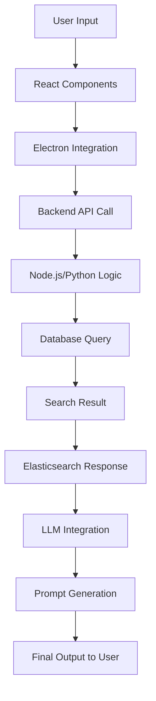

# Technical Specification Document: Prompt Manager Application

## 1. Executive Summary
The Prompt Manager Application aims to streamline the workflow of managing and generating prompts by providing a centralized library with search capabilities and integration with Large Language Models (LLMs). This tool will reduce repetitive tasks, enhance productivity, and enable more efficient prompt generation for research and development purposes.

## 2. Problem Statement
- **Repetitive Task Overhead:** Frequent re-entry of similar prompts leads to inefficiency.
- **Scattered Resources:** Prompts are often stored in disparate locations, making them difficult to manage and retrieve.
- **Complexity in Prompt Generation:** Creating elaborate prompts requires significant time and expertise, especially for research purposes.

## 3. Proposed Architecture
The architecture is designed as a modular monolithic application with clear boundaries and event-driven communication. Key components include:

### Frontend:
- **Technology:** React (for UI logic) and Electron (for desktop integration).
- **Functionality:** Searchable sidebar panel, drag-and-drop functionality, and integration with the prompt library.

### Backend:
- **Technology:** Node.js or Python.
- **Modules:**
  - **Prompt Library:** Stores prompts in a structured format using SQLite or PostgreSQL.
  - **Search Engine:** Implements semantic search using Elasticsearch.
  - **LLM Integration:** Uses libraries like `langgraph` or `transformers` for prompt processing and integrates with LLM APIs (e.g., OpenAI).
  - **Security Layer:** Implements JWT-based authentication and authorization.

### Event-Driven Architecture:
- **Technology:** RabbitMQ.
- **Functionality:** Decouples services and handles communication asynchronously, ensuring loose coupling.

## 4. Resolved Constraints
1. **Tight Coupling Risk:**
   - **Solution:** Modular monolithic architecture with event-driven communication using RabbitMQ.

2. **Latency Concerns:**
   - **Solution:** Circuit breakers and timeouts within the application layer to handle latency gracefully, optimized database queries, and API calls.

3. **Search Implementation:**
   - **Solution:** Start with Elasticsearch for semantic search, then integrate vector databases like Milvus as needed.

4. **LLM Integration Details:**
   - **Solution:** Use existing libraries (`langgraph`, `transformers`) and specify exact API endpoints (e.g., OpenAI) in the Proof of Concept (PoC) phase.

5. **Simplifying Initial Scope:**
   - **Solution:** Develop a basic MVP focusing on core functionality (prompt management and search) without LLM integration, then iterate based on feedback.

## 5. Technical Stack
### Frontend:
- **React:** For building the UI components.
- **Electron:** For creating a native desktop application.

### Backend:
- **Node.js/Python:** For handling business logic and integration with external services.
- **Elasticsearch:** For semantic search implementation.
- **LangGraph/Transformers:** For LLM integration and prompt processing.
- **RabbitMQ:** For event-driven communication.

### Database:
- **SQLite/PostgreSQL:** For storing prompts and managing the library.

### Security:
- **JWT:** For authentication and authorization.

## 6. Implementation Roadmap
### High-Level Steps for Proof of Concept (PoC):
1. **Setup Basic MVP:**
   - Implement core functionality (prompt management, search).
   - Use SQLite or PostgreSQL for storage.
   - Develop a basic UI with React and Electron.

2. **Integrate Search Engine:**
   - Implement Elasticsearch for semantic search.
   - Test performance and accuracy.

3. **Implement LLM Integration:**
   - Use `langgraph` or `transformers` libraries.
   - Integrate with OpenAI API for prompt generation.

4. **Add Security Layer:**
   - Implement JWT-based authentication.
   - Add RBAC to secure sensitive data.

5. **Test and Optimize:**
   - Conduct thorough testing for edge cases.
   - Optimize database queries and API calls for performance.

## 7. Mermaid Diagrams
### System Architecture:
```mermaid
graph TD
    A[Frontend] --> B[React Components]
    B --> C[Electron Integration]
    C --> D[Native Desktop App]
    A --> E[Backend Services]
    E --> F[Node.js/Python Logic]
    F --> G[Database (SQLite/PostgreSQL)]
    F --> H[Elasticsearch Search Engine]
    F --> I[RabbitMQ Event Bus]
    I --> J[Event Consumers]
```

### Data Flow:


## 8. Stability Score
**Stability Score:** 9/10  
STATUS: READY_FOR_DOCS  

The architecture is well-defined, with modern patterns addressing potential issues. The system is stable enough for documentation but may require further testing in edge cases.

---

This document provides a comprehensive overview of the Prompt Manager Application's architecture and implementation plan. It is designed to be used as a starting point for development by senior engineers familiar with modern software architectures and technologies.